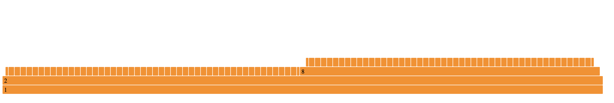
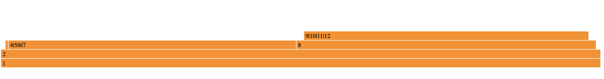

# Description
A set of tools to process and produce flame graphs, typically when visualising call stack profiles. 

# Get started
These tools take data in the form of a csv file or from stdin. Each row defines a node, characterised by a string description `Content` and a floating point metric `Metric`. Each node has an integer `Id`, and a reference to its parent node `ParentId`.
Root nodes should have `Id = ParentId = -1`. The form of the file is:

```
Id,ParentId,Content,Metric
```

To generate an example flame graph, build the solution then `flame -f sample.csv`. An svg file `flame.svg` will be produced.



# Pre-processing data
## Aggregating consecutive repeated sequences
The input data's used to build a simple rose tree. In some cases a node might have a very large number of small-duration children which will take a long time to not be rendered on the flame chart. The `aggregate` tool processes the input data to identify repeated sequences in child nodes and aggregate them.

The sample data as a run of child nodes whose content repeats the pattern `4, 5, 6, 7, 4, 5, 6, 7, ... etc`. We can automatically identify and aggregate these, replacing them with a single node that details the number of repeats, the total `Metric`, and the `Content` involved.

To aggregate those repeated sequences and produce a flame graph run: `aggregate -f sample.csv -l 10 | flame`.



# Notes and thanks

Uses Jonathon Pryor's Mono.Options library for command line parsing.

Uses Saar Shen's [FlameGraphNet](https://github.com/xiaomi7732/FlameGraphNet/tree/develop) library under the MIT licence.